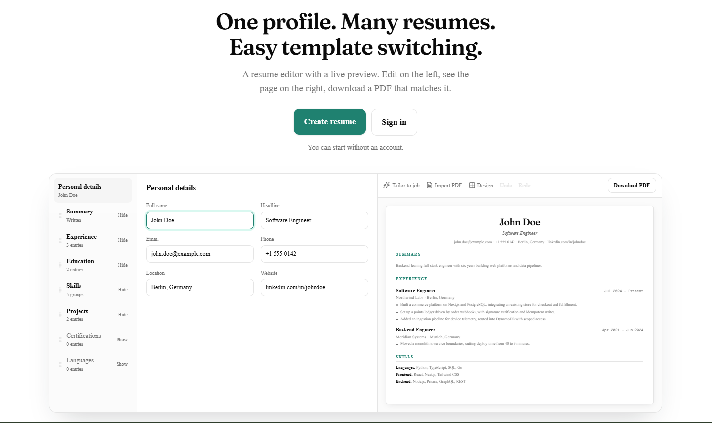
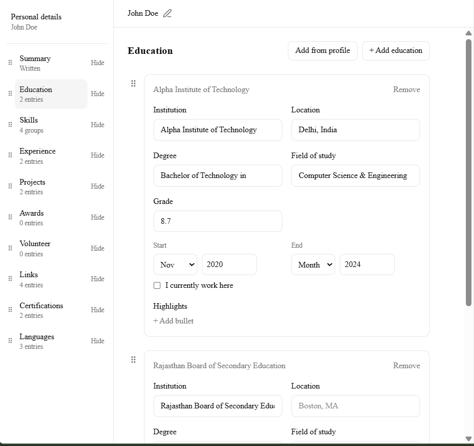
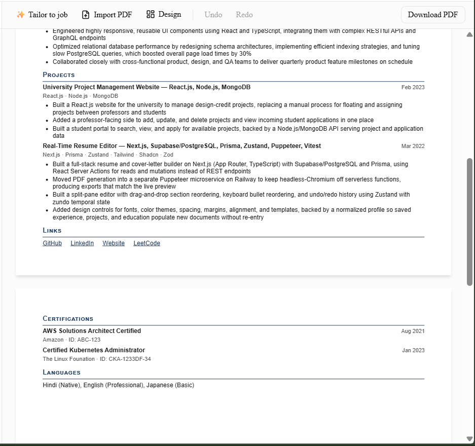
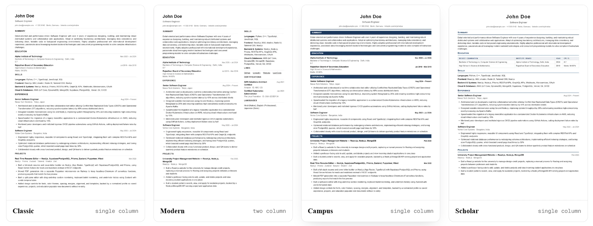
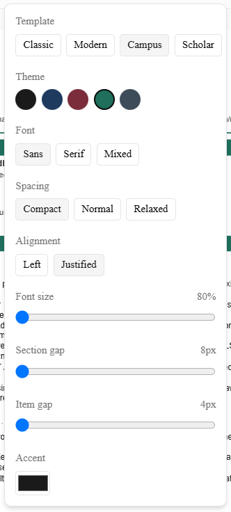
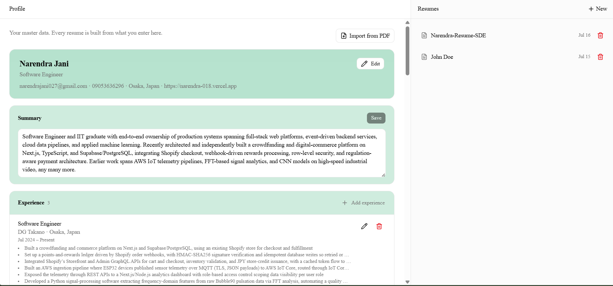
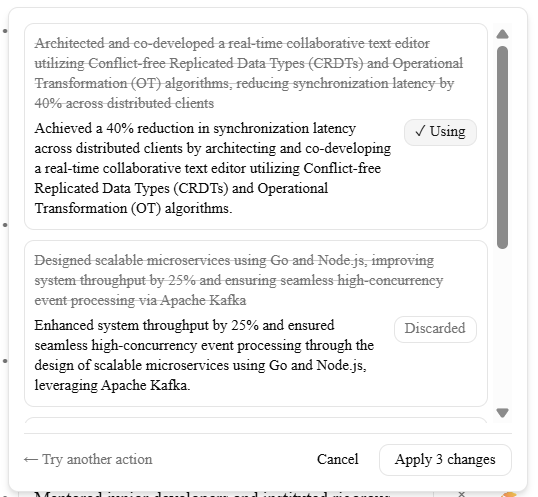

<!-- README.md -->

# Rezumatio

**A resume editor where what you see is precisely what you download.**

Fill in your career once. Build as many resumes from it as you need — each one restyled, reordered, and tailored to a specific job — and export a pixel-identical PDF with selectable, ATS-readable text.

<!-- TODO: replace with the deployed URL -->
🔗 **[Live demo](#)** · ✍️ **[Try it without an account](#/try)**

<!-- TODO: images/hero.png — the full editor: left form pane, right live A4 preview, ~1600px wide -->


> **About this repository:** the application source is private. This repo exists to document the product, the architecture, and the engineering decisions behind it.

---

## Contents

- [The problem](#the-problem)
- [Features](#features)
- [How it works](#how-it-works-the-interesting-parts)
- [Tech stack](#tech-stack)
- [Status](#status)

---

## The problem

Every resume builder makes you choose. Either you get a beautiful template you can't edit properly, or a text editor that produces a document nobody wants to read. And when you finally export, the PDF doesn't quite match what was on screen — a bullet slips onto page two, a heading strands itself at the bottom of a page.

Underneath that is a data problem. Your career doesn't change between job applications; only the *presentation* does. Most tools conflate the two, so every new resume means retyping everything.

Rezumatio separates them. Your profile is the master record. A resume is a customizable view of it.

---

## Features

### 📝 A structured editor, not a text box

The left pane is a section navigator with a dedicated form for each part of your resume — ten section types in total: summary, experience, education, projects, skills, links, certifications, awards, languages, and volunteer work.

Each field is its own input. Companies, job titles, locations, and dates are discrete data, not free-floating text, which is what makes everything downstream possible: consistent formatting across templates, clean PDF export, and AI that operates on one bullet at a time instead of mangling your whole document.

- **Bullets as a dynamic list** — each bullet is its own input. Press `Enter` to add the next one, drag to reorder, delete individually.
- **Rich text where it helps** — bold, italic, and lists inside summaries and descriptions, powered by Tiptap.
- **Drag-and-drop entry reordering** — reorder experiences, projects, or education entries within a section.
- **Show/hide sections** — toggle a section off without deleting its content.
- **Global undo/redo** — `Ctrl+Z` works across everything: typing, reordering, template switches, and accepted AI suggestions alike. One history, no per-feature special cases.
- **Autosave** — debounced, with a flush-on-leave so closing the tab doesn't cost you work.

<!-- TODO: images/editor-forms.png — the section navigator + an experience form with several bullets, showing the drag handles -->


---

### 👁️ A live preview that paginates like real paper

The right pane renders true A4 pages — plural. As you type, the app measures every block of content and packs it onto pages, breaking *between* entries rather than through them, and never stranding a section heading at the bottom of a page.

This isn't a preview approximation. The page breaks you see on screen are the exact page breaks in your PDF, because the same pagination result is what gets printed. (More on how in [How it works](#how-it-works-the-interesting-parts).)

<!-- TODO: images/pagination.png — a two-page resume in the preview, showing a clean break between entries -->


---

### 🎨 Templates and design controls

Switch templates in one click. Your content is never touched — only the layout and styling change.

| | |
|---|---|
| **Templates** | Classic (single-column) and Modern (two-column: main + sidebar). Switching between them remaps your sections into the new column structure automatically. |
| **Color themes** | Classic, Navy, Burgundy, Emerald, Slate — plus a custom accent color picker that overrides the theme. |
| **Font schemes** | Sans, Serif, or Mixed (serif headings, sans body). |
| **Spacing** | Compact / Normal / Relaxed presets that scale page margins and rhythm together. |
| **Fine controls** | Font size (80–140%), section gap, item gap, and left/justified text alignment. |

Section reordering happens in layout order, grouped by column. Sections move up and down within their column — never across, which is a deliberate product decision (a sidebar-sized "Experience" section isn't a feature, it's a bug waiting to happen).

<!-- TODO: images/templates.png — side-by-side of Classic and Modern rendering the same content -->


<!-- TODO: images/design-panel.png — the Design popover open, showing theme swatches and sliders -->


---

### 👤 Profile as master data

Your profile holds the canonical version of your career — every job, degree, project, certification, and skill group, stored as proper relational records rather than a blob of text.

**Add from profile** pulls any entry into a resume as a *snapshot copy*, not a reference. Tailoring a resume for one application can't mutate your profile, and editing your profile can't silently rewrite a resume you already sent out. Each copy remembers where it came from, which leaves the door open for a "re-sync from profile" action later.

<!-- TODO: images/profile.png — the profile page with several sections populated -->


---

### ✨ AI assistance, scoped to what you can actually review

The design principle here is that a suggestion you can't evaluate is a suggestion you shouldn't accept. So there is no "enhance my resume" button that rewrites 400 words and hands you an unreviewable diff. Instead:

**Per-bullet enhancement.** Quick-action chips — *More impactful*, *More concise*, *Fix grammar*, *Quantify* — return two or three variants for a single bullet. Pick one, or discard them all. Context (your job title, the company, the target job description if you've pasted one) goes along with the request even though only one bullet comes back, so suggestions stay relevant.

**Per-entry enhancement.** Improve all the bullets of one job at once, under a strict 1:1 contract — *n* bullets in, exactly *n* bullets out, in the same order. Results are staged for per-bullet Use/Skip review, then applied as a single atomic change (so one `Ctrl+Z` undoes the whole thing).

**Summary rewrite.** Same review-then-apply flow for your professional summary.

**Tailor to a job description.** Paste a JD; the app rewrites your summary and your bullets section by section to surface the genuine overlap with that role. Results stream in progressively as each section finishes, and you accept or skip each one. Applying is a single undo step.

Three rules constrain every AI call:

1. **Prose only.** The model can rewrite bullet text and summary prose. It cannot touch dates, employers, job titles, degrees, skills lists, or section order — enforced structurally, since those shapes are the only things it's able to return.
2. **No fabrication.** It may re-emphasize, adopt the job's vocabulary where your text already supports it, and reorder emphasis within a line. It may not invent a metric, a tool, or a technology you never mentioned.
3. **You always review.** Nothing is applied without an explicit accept.

Pasted job descriptions are ephemeral — used for the request, never stored. API keys live server-side only; the browser never sees them. Usage is metered per user with a daily limit and per-request cost tracking.

<!-- TODO: images/ai-bullet.png — the enhance chips open on a bullet with 2–3 variants shown -->


<!-- TODO: images/tailor.png — the tailor panel with a JD pasted and per-section Use/Skip cards -->


---

### 📄 PDF export

One click, real PDF. Selectable text (not an image), standard headings, and a parseable structure — which is what ATS software actually needs. Rendered by headless Chromium from the same HTML and CSS the preview uses, printing the same pages the preview computed.

Your resume data never leaves the project's own infrastructure to get there.

---

### 🕶️ Try it without an account

The `/try` route is a fully working editor with no signup — everything persists to your browser's local storage. When you eventually create an account, your draft is promoted to a real resume on your first authenticated visit. One-way, and local storage is only cleared once the server confirms the save.

---

### 📥 Import an existing resume *(in progress)*

Upload a PDF; text is extracted in your browser and parsed into structured profile data by an LLM against a strict schema. Nothing is written until you review it on a confirm screen and deselect anything the parser got wrong — and it only ever *appends*, never overwrites what you already have. The PDF itself is never uploaded or stored.

---

## How it works (the interesting parts)

This is the portfolio half of the README. Four decisions shape the entire codebase.

### Content / Layout / Style are orthogonal

```
Content  →  your data: basics + ordered sections        (JSONB)
Layout   →  columns of section IDs, in render order     (JSONB)
Style    →  template + theme + font scheme + options    (columns)
```

Three concerns, three storage locations, no overlap. Switching templates writes `style.templateId` and a remapped `layout` — atomically, as one undo step — and provably cannot touch `content`. That's what makes *"fill once, switch freely"* true rather than aspirational.

A single-column layout isn't a special case. It's just the one-column instance of the column model, so there's exactly one drag system and one pagination path, with no branching.

### One render source of truth

Templates don't render two ways. They export a single function:

```ts
buildBlocks(content, layout, style) → ResumeBlock[]
```

Each block is an atomic, paginatable unit — a header, a section title, or one entry — tagged with the column it flows in. A pure packer assigns measured blocks to A4 pages. The preview renders those pages; the PDF builder renders *the same components* with *the same stylesheet* into the *same page assignments*.

Preview/PDF parity isn't tested for. It's true by construction. There is no second render path to drift.

**Client-side pagination is authoritative.** The browser measures the real, laid-out DOM (the only place with truthful font metrics), and the export endpoint receives the resulting page assignments and prints them verbatim. The server never re-paginates and never guesses.

### Draft-tolerant saves, strict exports

An in-progress resume legitimately has an empty job title, a half-typed email, and a missing end date. Blocking the save on that would be hostile. So saves validate *structure only* — is this a coherent document? — while the strict, complete schema gates PDF export and produces human-readable issues.

Two gates, two different questions, one schema definition.

### Security in two layers

Row-Level Security policies live in the database, versioned as SQL inside migration files. But the ORM connects with a role that bypasses RLS — so every data-access function is *also* scoped by user ID at the application layer. Ownership checks are baked into the `WHERE` clause, so an update to someone else's record affects zero rows rather than leaking anything.

Neither layer is decorative. RLS covers direct database access; app-layer scoping covers everything the ORM does.

---

## Tech stack

| Layer | Choice | Why |
|---|---|---|
| **Framework** | Next.js 16 (App Router), React 19, TypeScript strict | Full-stack in one repo; Server Components by default; Server Actions instead of a hand-rolled fetch layer. |
| **Styling** | Tailwind v4 (CSS-first, no config file) | Design tokens as CSS variables — which is exactly what the theme system needs. |
| **UI components** | shadcn/ui (Radix + Tailwind) | Accessible primitives, styled by our own tokens, source lives in-repo. No second styling runtime. |
| **Editor state** | Zustand 5 + zundo | One store shared by the editor and preview. Zundo's temporal middleware gives global undo/redo nearly for free. |
| **Rich text** | Tiptap 3 | Bold/italic/lists inside description fields, with a plain-text bridge so AI output can never inject markup. |
| **Drag & drop** | dnd-kit | Modern, accessible, performant. One `DndContext` per column, so cross-column drops are impossible by construction. |
| **Validation** | Zod 4 | One schema shared by forms, server actions, the database contract, AI outputs, and the PDF parser. |
| **Database** | Supabase Postgres + Row-Level Security | Normalized tables for profile master data; JSONB for the resume document. |
| **ORM** | Prisma 7 (`@prisma/adapter-pg`) | Type-safe access; migrations (including RLS as raw SQL) versioned in git. |
| **Auth** | Supabase Auth | Magic-link / PKCE flow. |
| **PDF** | Puppeteer, as a dedicated microservice | WYSIWYG fidelity and selectable text. Isolated from serverless Chromium limits — and your resume PII stays in our infrastructure rather than a third-party rendering API. |
| **AI** | Provider abstraction over Claude and OpenAI | Swap providers per feature via env; keys server-side only; structured, Zod-validated outputs. |
| **PDF parsing** | pdf.js (in-browser) | Text extraction happens client-side. The file is never uploaded. |
| **Testing** | Vitest + `tsc --noEmit` | Scoped to pure, deterministic logic — pagination, layout ops, validation — where tests earn their keep. Type-checking runs as a separate pass. |
| **Hosting** | Vercel (app) · Supabase (data/auth) · Railway (PDF service) | |

---

## Status

| | |
|---|---|
| ✅ | Auth, profile master data, full editor, live multi-page preview |
| ✅ | Two templates, themes, font schemes, design controls, template switching |
| ✅ | PDF export, guest mode with account promotion |
| ✅ | AI: per-bullet, per-entry, summary rewrite, tailor-to-JD |
| 🚧 | PDF import & parsing (schema and normalization done; upload + review UI in progress) |
| 📋 | "My Resumes" dashboard, resume duplication, OCR for scanned PDFs |

---

## Roadmap

- **ATS-friendliness check** — a score plus specific warnings, not a vague grade
- **Cover letter generation** from your profile and a job description
- **Shareable view-only link** for recruiters
- **DOCX and plain-text export** alongside PDF
- **LinkedIn import** to seed the profile
- **Version history** and snapshots

---

<!-- TODO: pick a license, or delete this section for a docs-only repo -->
## License

Documentation in this repository is available under [CC BY 4.0](https://creativecommons.org/licenses/by/4.0/). The application source is private.
